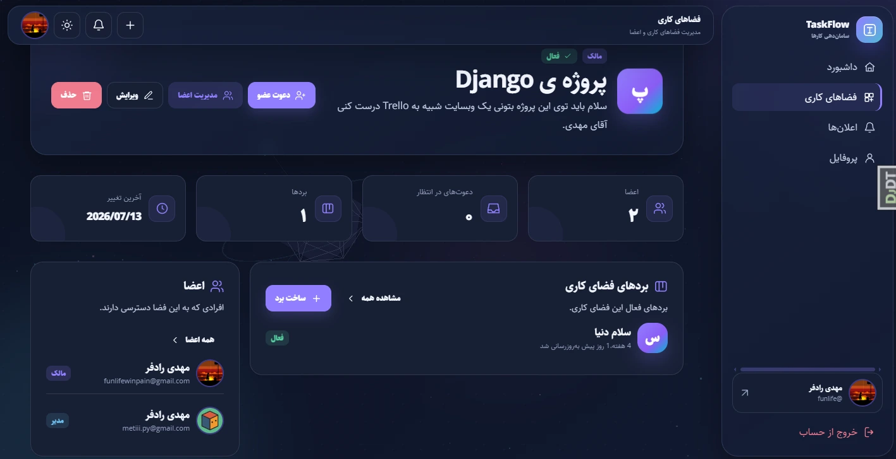

<div align="center">

# TaskFlow

**A Persian-first collaborative task management application built to showcase Django backend engineering.**

Django 6 · Python 3.14 · PostgreSQL · Redis · Gunicorn · Nginx · Docker Compose

[](https://github.com/funlifew/taskflow-django-application/actions/workflows/ci.yml)

[Overview](#overview) ·
[Preview](#preview) ·
[Architecture](docs/ARCHITECTURE.md) ·
[Data Model](docs/DATA_MODEL.md) ·
[Permissions](docs/PERMISSIONS.md) ·
[Docker](#docker) ·
[Testing](#testing)

</div>

---

## Overview

TaskFlow is a server-rendered collaborative task management application built with Django.

The project is intentionally designed as a **backend engineering portfolio project**, not as a commercial SaaS product.

Its goal is to demonstrate practical experience with:

- Django application architecture
- Domain modeling
- Role-based access control
- Nested-resource authorization
- Service and selector layers
- Transaction-safe business workflows
- PostgreSQL
- Redis application caching
- Transactional email workflows
- Database constraints
- Drag-and-drop ordering
- Automated testing
- Deployment-oriented configuration
- Docker Compose
- Responsive Persian RTL UI

The main resource hierarchy is:

```text
Workspace
└── Board
    └── Column
        └── Task
            ├── Comments
            └── Activity history
```

TaskFlow uses Django Templates for server-rendered pages and adds JavaScript only where richer interaction is useful.

---

## Preview

<p align="center">
  
</p>

TaskFlow provides a Persian-first RTL workflow for collaborative project management, with role-aware interactions, drag-and-drop ordering and responsive layouts.

Additional views:

[Dashboard](docs/assets/screenshots/dashboard.webp) ·
[Task detail](docs/assets/screenshots/task-detail.webp) ·
[Workspace members](docs/assets/screenshots/members.webp) ·
[Mobile](docs/assets/screenshots/mobile.webp)

---

## Engineering Highlights

TaskFlow goes beyond basic CRUD by focusing on the behavior around the data.

| Area | Implementation |
|---|---|
| Authorization | Workspace roles and nested-resource scoping |
| Business logic | Explicit service layer |
| Read logic | Reusable selector layer |
| Transactions | `transaction.atomic()` and row locking |
| Ordering | Transaction-safe task and column reordering |
| Integrity | Application validation plus database constraints |
| Caching | Redis-backed aggregate caching with explicit invalidation |
| Email | Shared text/HTML transactional email gateway |
| Notifications | Persistent user-scoped notification domain |
| Audit history | Explicit task activity events |
| Testing | Isolated Django regression tests |
| Quality | Ruff linting |
| Runtime | Gunicorn behind Nginx |
| Containers | Django + PostgreSQL + Redis + Nginx with Docker Compose |
| CI | GitHub Actions quality, migration, test and Docker build checks |

---

## Features

### Accounts

- Custom Django user model
- Registration
- Email activation
- Activation resend cooldown
- Login and logout
- Password reset
- Password change
- Profile management
- Avatar upload and validation

### Workspaces

- Workspace CRUD
- Archive and restore
- Membership management
- Workspace invitations
- Invitation expiration
- Role management
- Member removal
- Transaction-safe invitation acceptance

### Role-based access control

TaskFlow supports four workspace roles:

| Role | Access |
|---|---|
| Owner | Full workspace administration |
| Admin | Administrative access within owner-defined limits |
| Member | Collaborative write access |
| Viewer | Read-only access |

Backend permission checks remain authoritative even when UI controls are hidden.

Nested resources are scoped through their parent hierarchy so unrelated resource IDs cannot be combined to access or mutate data from another workspace.

### Boards and columns

- Board CRUD
- Board archive and restore
- Ordered columns
- Column archive and restore
- Position normalization
- Previous/next movement
- Drag-and-drop column ordering

### Tasks

Tasks support:

- Title and description
- Priority
- Status
- Assignee
- Creator
- Due date
- Ordered position
- Archive state
- Archive timestamp

Task statuses:

```text
To do
In progress
Blocked
Done
Canceled
```

Priorities:

```text
Low
Medium
High
Urgent
```

### Task movement

Tasks can be:

- Reordered inside a column
- Moved between columns
- Dragged with SortableJS
- Moved with server-rendered fallback controls

The backend validates and normalizes ordering independently from the frontend.

### Comments

- Comment creation
- Author editing
- Soft deletion
- Administrative moderation
- Deleted-comment metadata

### Activity history

Important task changes generate explicit activity records.

Examples include:

- Creation
- Update
- Status change
- Assignment change
- Movement
- Reordering
- Comment events
- Archive
- Restore

### Notifications

TaskFlow provides persistent in-app notifications for events such as:

- Task assignment
- Reassignment
- Status change
- Task comments
- Workspace invitations
- Workspace role changes
- Membership removal

Users can:

- View their notification inbox
- See unread counts
- Mark individual notifications as read
- Mark all notifications as read

Notification access is scoped to the recipient.

### Dashboard

The dashboard is calculated from real user-accessible data.

It includes:

- Workspace count
- Board count
- Assigned tasks
- Completed tasks
- Overdue tasks
- Upcoming deadlines
- Personal progress
- Workspace progress
- Board progress
- Recent activity
- Recent notifications

---

## Redis caching

Redis is used as an application component rather than only being configured as infrastructure.

Cached data includes selected primitive dashboard aggregates:

```text
User dashboard summary
User task progress
Workspace progress
Board progress
```

The cache architecture uses:

- Versioned cache namespaces
- Explicit mutation-aware invalidation
- Post-commit invalidation
- Short TTLs for time-sensitive metrics
- Longer TTLs for explicitly invalidated progress data
- Fail-open cache behavior
- Soft cache-stampede protection

Model instances and QuerySets are intentionally not stored in Redis.

Unread notification counts remain live to avoid coupling notification read-state mutations to dashboard cache invalidation.

---

## Email architecture

Transactional email is routed through a shared synchronous email gateway.

Supported flows include:

- Account activation
- Activation resend
- Password reset
- Workspace invitation

Emails support:

- Text bodies
- HTML alternatives
- Shared subject rendering
- Recipient normalization
- Centralized error handling
- Delivery-count validation
- Failure logging

Workspace invitation email is scheduled after the related database transaction commits.

The project deliberately does not introduce Celery or a background queue because asynchronous email processing is outside the current portfolio scope.

---

## Architecture

### Application flow

```text
HTTP Request
    │
    ▼
Django View
    │
    ├── Form / request validation
    │
    ▼
Service Layer
    │
    ├── Permissions
    ├── Business rules
    ├── Transactions
    ├── Domain side effects
    │
    ▼
Django ORM
    │
    ├── PostgreSQL
    └── Redis
```

Read-heavy operations are organized separately:

```text
View / Dashboard
       │
       ▼
    Selector
       │
       ▼
   Django ORM
```

### Project structure

```text
taskflow-django-application/
│
├── apps/
│   ├── accounts/
│   ├── boards/
│   ├── columns/
│   ├── core/
│   ├── dashboard/
│   ├── notifications/
│   ├── tasks/
│   └── workspaces/
│
├── config/
│   ├── settings/
│   │   ├── base.py
│   │   ├── development.py
│   │   ├── docker.py
│   │   ├── production.py
│   │   └── test.py
│   │
│   ├── urls.py
│   └── wsgi.py
│
├── docker/
│   ├── entrypoint.sh
│   └── nginx/
│       └── default.conf
│
├── static/
├── templates/
│
├── Dockerfile
├── docker-compose.yml
├── gunicorn.conf.py
├── manage.py
├── pyproject.toml
└── poetry.lock
```

---

## Environment profiles

TaskFlow separates configuration by environment.

| Profile | Database | Cache | Email | Purpose |
|---|---|---|---|---|
| `development` | SQLite | LocMem / optional Redis | Console | Normal local development |
| `test` | In-memory SQLite | LocMem | LocMem | Isolated automated tests |
| `docker` | PostgreSQL | Redis | Console | Production-like local stack |
| `production` | PostgreSQL | Redis | SMTP | Deployment-oriented configuration |

The production profile also includes secure cookies, HTTPS-related settings, HSTS, CSP, manifest static files and structured logging.

---

# Docker

The repository includes a complete local multi-container runtime.

```text
                     ┌──────────────┐
Browser ───────────► │    Nginx     │
                     └──────┬───────┘
                            │
                            ▼
                     ┌──────────────┐
                     │   Gunicorn   │
                     │    Django    │
                     └──────┬───────┘
                            │
                   ┌────────┴────────┐
                   ▼                 ▼
             PostgreSQL            Redis
```

Services:

| Service | Purpose |
|---|---|
| `nginx` | Reverse proxy and static/media delivery |
| `web` | Django running under Gunicorn |
| `db` | PostgreSQL |
| `redis` | Shared Django cache |

The database uses a persistent Docker volume.

Static and media files are shared between Django and Nginx through named volumes.

### Start with Docker

Clone:

```bash
git clone https://github.com/funlifew/taskflow-django-application.git
cd taskflow-django-application
```

Create the Docker environment:

```bash
cp .env.docker.example .env.docker
```

Validate Compose:

```bash
docker compose \
  --env-file .env.docker \
  config
```

Build:

```bash
docker compose \
  --env-file .env.docker \
  build
```

Start:

```bash
docker compose \
  --env-file .env.docker \
  up -d
```

Check container health:

```bash
docker compose ps
```

Open:

```text
http://localhost:8000/
```

### Create a superuser

```bash
docker compose exec \
  web \
  python manage.py createsuperuser
```

Django Admin:

```text
http://localhost:8000/admin/
```

### View logs

```bash
docker compose logs -f web nginx
```

### Stop

```bash
docker compose down
```

To also reset PostgreSQL and application volumes:

```bash
docker compose down -v
```

---

# Local development

Docker is optional.

For normal development, TaskFlow can run directly with Poetry and SQLite.

## Requirements

- Python 3.14+
- Poetry
- Git

Clone the repository:

```bash
git clone https://github.com/funlifew/taskflow-django-application.git
cd taskflow-django-application
```

Install dependencies:

```bash
poetry install
```

Create the local environment:

```bash
cp .env.example .env
```

Apply migrations:

```bash
poetry run python manage.py migrate
```

Create a superuser:

```bash
poetry run python manage.py createsuperuser
```

Start Django:

```bash
poetry run python manage.py runserver
```

Open:

```text
http://127.0.0.1:8000/
```

Development uses SQLite and does not require PostgreSQL or Redis unless Redis is explicitly enabled.

---

## Testing

The test environment is isolated from external infrastructure.

Run the complete suite:

```bash
poetry run python manage.py test \
  --settings=config.settings.test
```

Run Django checks:

```bash
poetry run python manage.py check \
  --settings=config.settings.development
```

Verify that no migrations are missing:

```bash
poetry run python manage.py makemigrations \
  --check \
  --dry-run \
  --settings=config.settings.test
```

Run Ruff:

```bash
poetry run ruff check \
  apps \
  config \
  manage.py \
  gunicorn.conf.py
```

---

## Technology stack

### Backend

| Technology | Purpose |
|---|---|
| Python 3.14 | Programming language |
| Django 6 | Web framework |
| PostgreSQL | Relational database |
| SQLite | Lightweight local/test database |
| Redis | Cache and coordination |
| django-redis | Django Redis integration |
| Psycopg | PostgreSQL driver |
| Pillow | Image processing |
| python-decouple | Environment configuration |
| Gunicorn | WSGI application server |

### Frontend

| Technology | Purpose |
|---|---|
| Django Templates | Server rendering |
| HTML / CSS | Interface |
| Vanilla JavaScript | Client interaction |
| SortableJS | Drag-and-drop |
| Three.js | Visual effects |
| GSAP | UI animation |

### Engineering

| Technology | Purpose |
|---|---|
| Poetry | Dependency management |
| Ruff | Python linting |
| Docker | Application container |
| Docker Compose | Multi-container orchestration |
| Nginx | Reverse proxy and static delivery |
| Django TestCase | Automated regression testing |

---

## UI

TaskFlow is Persian-first and designed around RTL layouts.

The interface includes:

- Responsive desktop and mobile layouts
- Light and dark themes
- Mobile navigation
- Drag-and-drop interaction
- Touch-friendly controls
- Accessible focus states
- Reduced-motion support
- Notification dropdowns
- Three.js and GSAP visual enhancement

Visual effects are progressive enhancements and are not required for the core workflow.

---

## Project status

TaskFlow's main application and engineering scope is complete.

Completed work includes:

- Authentication and account lifecycle
- Workspace collaboration
- Role-based authorization
- Nested-resource security regression coverage
- Boards, columns and tasks
- Transactional reordering
- Comments and activity history
- Notifications
- Dashboard metrics
- Transactional email reliability
- Redis application caching
- Environment-specific settings
- PostgreSQL deployment profile
- Ruff linting
- Dockerized application runtime
- GitHub Actions CI
- Architecture documentation
- Data-model documentation
- Permission documentation
- Portfolio screenshots

The remaining work is limited to:

```text
Final manual QA
v1.0 release
Project freeze

---

## Intentional non-goals

TaskFlow does not need enterprise-scale infrastructure to fulfill its purpose.

The following are intentionally outside the current scope:

- Microservices
- Kubernetes
- Kafka
- Complex background workers
- Large distributed caches
- Multi-region deployment
- Real-time collaborative editing
- WebSockets everywhere
- Full observability platforms

Infrastructure is added only when it demonstrates a concrete engineering decision.

---

## License

TaskFlow is licensed under the MIT License.

See [LICENSE](LICENSE).

---

## Author

<div align="center">

### Mehdi Radfar

Backend Developer focused on **Python, Django and FastAPI**.

TaskFlow was built as a portfolio project focused on backend architecture,
permissions, transactional workflows, testing and practical infrastructure.

</div>