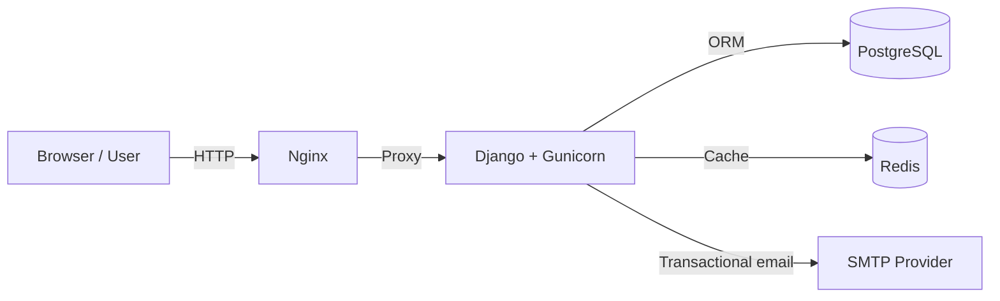
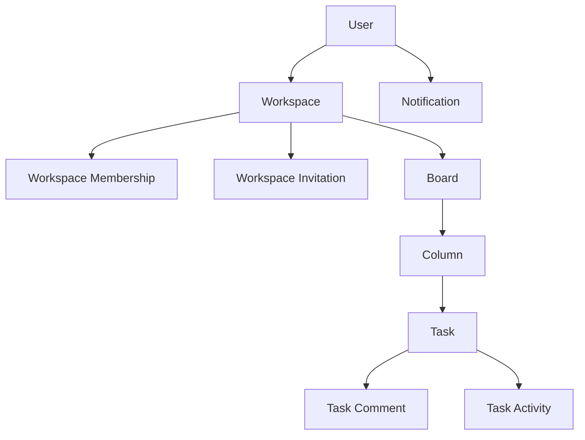
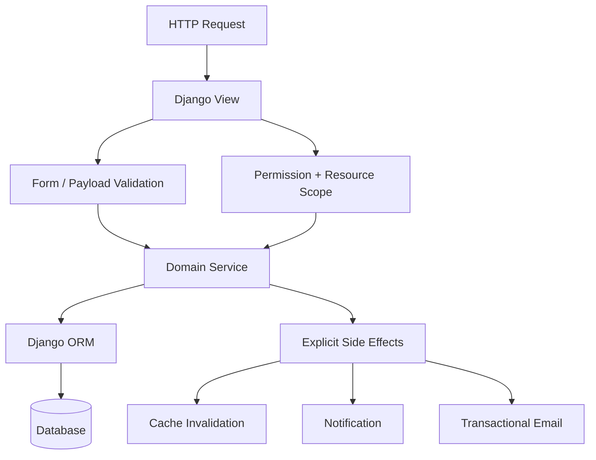
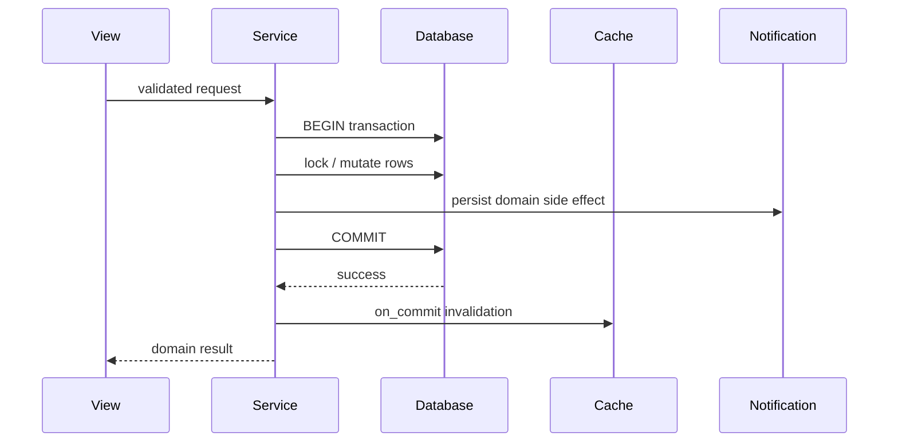
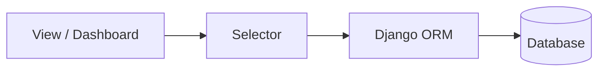
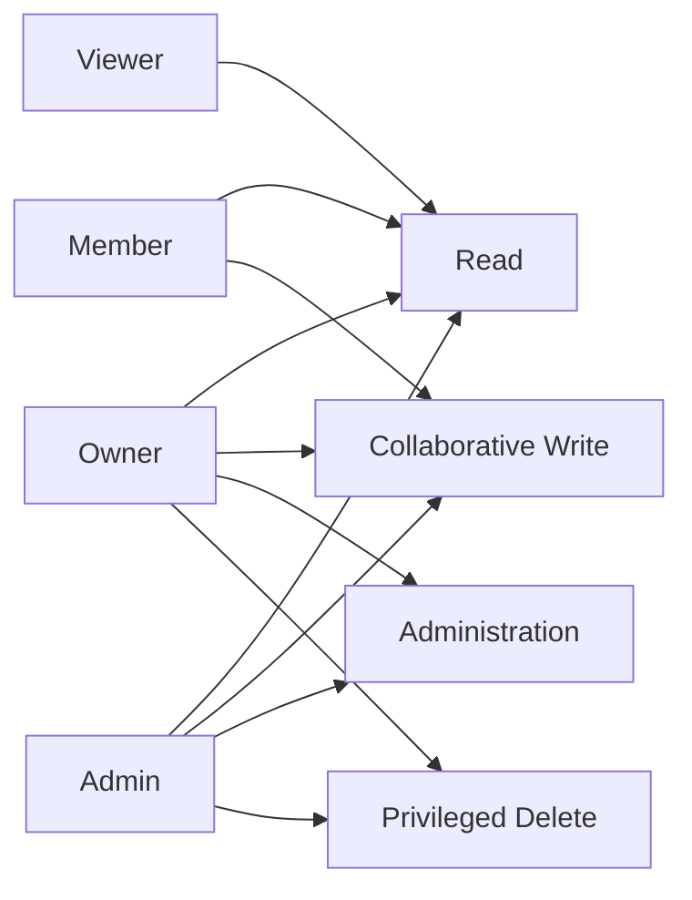
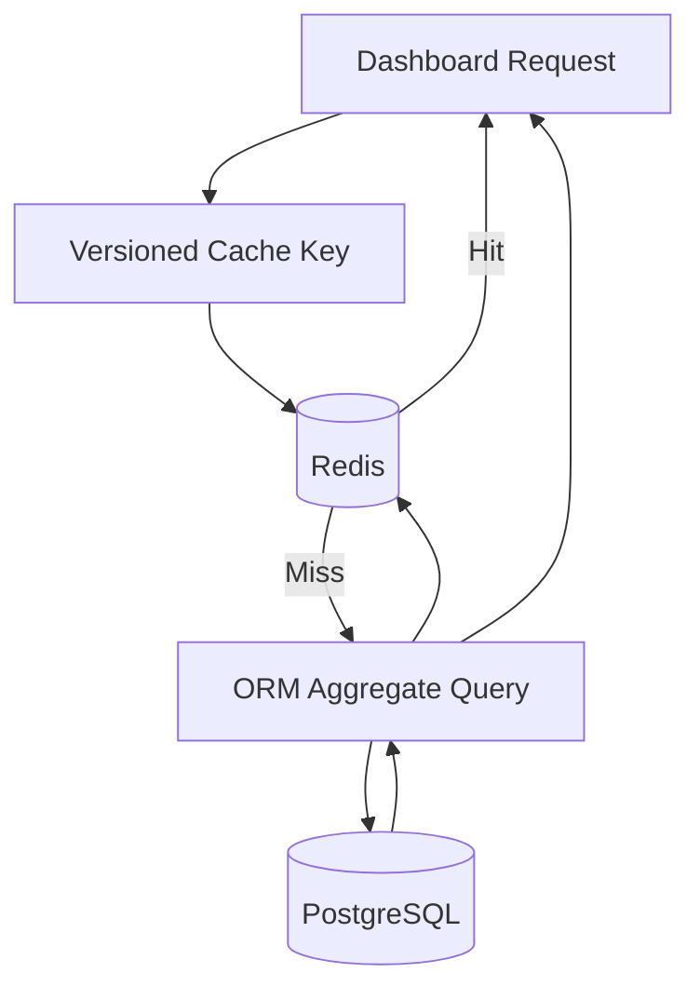
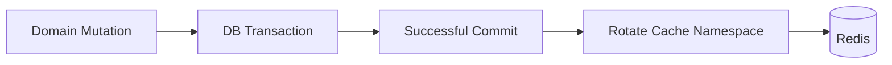
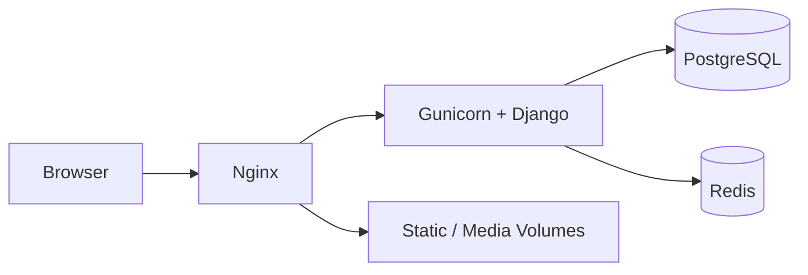

# TaskFlow Architecture

TaskFlow is a modular Django monolith built as a backend engineering portfolio project.

The architecture is intentionally designed around explicit domain boundaries, transactional services, reusable selectors, URL-scoped authorization, and a small amount of infrastructure that demonstrates practical deployment knowledge without turning the project into a distributed system.

---

## System context



For normal local development, SQLite and the console email backend can replace PostgreSQL and SMTP.

The Docker profile runs Django with PostgreSQL and Redis behind Nginx and Gunicorn.

---

## Domain hierarchy



The primary nested resource hierarchy is:

```text
Workspace
└── Board
    └── Column
        └── Task
            ├── Comment
            └── Activity
```

Every nested HTTP resource is resolved through its parent hierarchy.

For example, a Task is not retrieved only by `task_pk`.

Conceptually:

```python
Task.objects.filter(
    column=current_column,
    pk=task_pk,
)
```

This prevents unrelated IDs from different Workspaces, Boards or Columns from being combined into a valid request.

---

## Django applications

| Application | Responsibility |
|---|---|
| `accounts` | Authentication, registration, email activation and profiles |
| `workspaces` | Workspaces, memberships, roles and invitations |
| `boards` | Board lifecycle and workspace-scoped access |
| `columns` | Column lifecycle and ordered positioning |
| `tasks` | Tasks, comments, activity and reordering |
| `notifications` | Persistent user-scoped notifications |
| `dashboard` | User metrics and aggregate progress |
| `core` | Shared models, caching, email and permission infrastructure |

---

## Request architecture

TaskFlow separates HTTP concerns from domain mutations.



Views are primarily responsible for:

```text
HTTP input
forms
messages
redirects
template context
JSON parsing
response construction
```

Mutation-heavy business rules live in services.

---

## Service layer

Services own important mutations and business invariants.

Examples include:

```text
Workspace lifecycle
Workspace invitation processing
Membership role changes
Board lifecycle
Column lifecycle
Column reordering
Task lifecycle
Task reordering
Task comments
Task activity
Notification creation
```

Service methods use transactions where multi-model integrity matters.

Typical mutation:



---

## Selector layer

Read-heavy ORM operations are separated into selectors.



Selectors handle concerns such as:

```text
filtered resource collections
annotations
progress metrics
prefetching
accessible-resource queries
dashboard reads
```

This keeps templates and views from accumulating large query expressions.

---

## Authorization model

Workspace roles are:

```text
Owner
Admin
Member
Viewer
```

At a high level:



Authorization is enforced server-side.

Hiding a UI control is only a presentation enhancement and is never treated as the security boundary.

See [PERMISSIONS.md](PERMISSIONS.md) for the detailed matrix.

---

## Transaction strategy

Important workflows use:

```python
transaction.atomic()
```

and where concurrent access matters:

```python
select_for_update()
```

Examples include:

```text
Workspace invitation acceptance
Membership mutations
Task lifecycle operations
Task reordering
Column reordering
Comment mutations
```

This prevents business rules from depending on several independent database writes succeeding separately.

---

## Ordering model

Columns are ordered inside Boards.

Tasks are ordered inside Columns.

Active positions are constrained to remain unique within their parent resource.

Reordering uses transactional locking and temporary/staged positions where necessary before the final contiguous ordering is written.

```text
Board
├── Column position 0
├── Column position 1
└── Column position 2
```

and:

```text
Column
├── Task position 0
├── Task position 1
└── Task position 2
```

The frontend may perform optimistic drag-and-drop updates, but the backend remains the source of truth.

---

## Redis cache architecture

Redis stores selected primitive dashboard aggregates.

It does not store model instances or QuerySets.



Cached areas include:

```text
User dashboard summary
User task progress
Workspace progress
Board progress
```

Mutation paths rotate affected cache namespaces after successful database commits.



Cache failures fail open so Redis remains an optimization rather than a requirement for application correctness.

---

## Email architecture

Transactional email uses a shared gateway.

```text
Domain workflow
      ↓
Shared email gateway
      ↓
Text template + HTML template
      ↓
Django EmailMultiAlternatives
      ↓
Configured backend
```

Supported workflows include:

```text
Account activation
Activation resend
Password reset
Workspace invitation
```

Workspace invitation delivery is scheduled after transaction commit so a failed email does not roll back an already committed invitation.

Email delivery remains synchronous by design.

---

## Docker runtime

The Docker architecture is:



The stack intentionally remains small.

TaskFlow does not introduce Kubernetes, microservices, Kafka or worker infrastructure because those technologies would not improve the goals of this portfolio project.

---

## Environment profiles

```text
config/settings/
├── base.py
├── development.py
├── docker.py
├── production.py
└── test.py
```

| Environment | Database | Cache | Email |
|---|---|---|---|
| Development | SQLite | LocMem / optional Redis | Console |
| Test | SQLite | LocMem | In-memory |
| Docker | PostgreSQL | Redis | Console |
| Production | PostgreSQL | Redis | SMTP |

---

## Design principles

TaskFlow favors:

```text
explicit behavior over hidden side effects
a modular monolith over premature services
services over mutation-heavy views
selectors over duplicated ORM queries
transactions over best-effort multi-write workflows
database constraints over application assumptions
backend permissions over UI-only restrictions
selective caching over caching everything
portfolio clarity over infrastructure complexity
```

---

## Intentional non-goals

The project deliberately does not include:

```text
Microservices
Kubernetes
Kafka
Distributed tracing platforms
Real-time collaborative editing
Large worker infrastructure
Multi-region deployment
Complex event streaming
```

The goal is to demonstrate strong Django backend engineering rather than maximum infrastructure complexity.