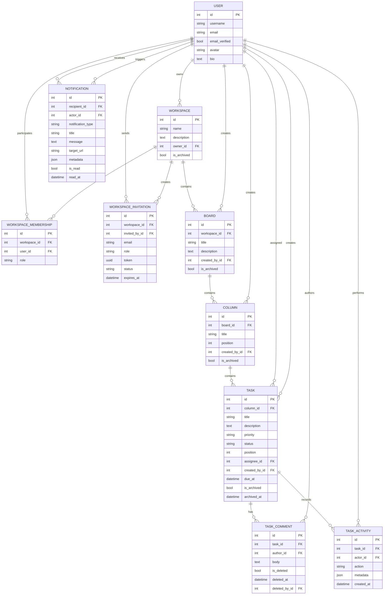

# TaskFlow Data Model

This document summarizes the primary application entities and their relationships.

It intentionally focuses on TaskFlow domain models rather than Django's internal authentication, session and migration tables.

---

## Entity relationship diagram



---

## Workspace membership

Users participate in Workspaces through `WorkspaceMembership`.

Supported roles are:

```text
owner
admin
member
viewer
```

A database uniqueness constraint prevents more than one membership row for the same:

```text
workspace + user
```

Workspace ownership is also stored directly on `Workspace.owner`.

---

## Workspace invitation

An invitation contains:

```text
Workspace
Inviter
Email
Requested role
Unique token
Status
Expiration time
```

Only one active pending invitation is allowed for the same:

```text
workspace + email
```

Invitation states are:

```text
pending
accepted
declined
expired
```

---

## Ordered resources

Column positions are unique among active Columns inside the same Board.

Conceptually:

```text
unique(board, position)
where is_archived = false
```

Task positions follow the same pattern:

```text
unique(column, position)
where is_archived = false
```

Archived rows are intentionally excluded from these conditional uniqueness constraints.

---

## Task archive invariant

Task archive state is constrained so that:

```text
active task
→ archived_at IS NULL
```

and:

```text
archived task
→ archived_at IS NOT NULL
```

Application validation and a database check constraint both protect this rule.

---

## Comment deletion invariant

Visible comments require:

```text
is_deleted = false
deleted_at = NULL
deleted_by = NULL
```

Deleted comments require a deletion timestamp.

The deleting user is retained where available.

---

## Notification read invariant

Notification read state follows:

```text
unread
→ read_at = NULL
```

```text
read
→ read_at IS NOT NULL
```

A database check constraint protects this relationship.

---

## Activity history

`TaskActivity` records important Task events independently from the mutable current Task state.

Examples:

```text
created
updated
status_changed
assignee_changed
moved
reordered
commented
comment_updated
comment_deleted
archived
restored
```

Additional event context is stored in a JSON metadata field.

---

## Indexing highlights

TaskFlow includes indexes for read patterns such as:

```text
Board by workspace/archive state
Column by board/archive state/position
Task by column/archive state/position
Task by assignee/status/due date
Comment by task/deletion state/time
Task activity by task/time
Notification by recipient/read state/time
```

These indexes correspond to common application access patterns rather than being added only for demonstration.